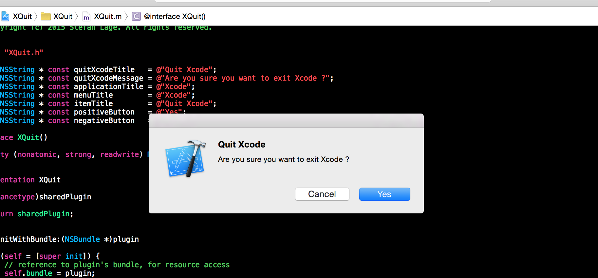

XQuit
-----
XQuit is an open source XCode plugin.
Sometimes you just use the wrong shortcut and press `⌘+Q`... 
With this plugin you don't have to worry about that awkwardness! 
It ask you if you really want to Quit Xcode.

